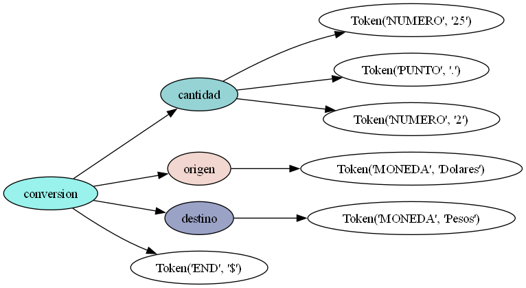

# PROYECTO CONVERSOR DE DIVISAS

Clase IS-913 DISEÑO DE COMPILADORES I-PAC 2024

GRUPO #2

## ANTES DE EJECUTAR

Version de python usada 3.13.
Se debe instalar Graphviz, y agregarlo al PATH del sistema para poder generar el arbol sintactico.

Se deben instalar los modulos correspondientes con el siguiente comando:

```bash
  pip install -r requirements.txt
```

# PARA EJECUTAR EL PROYECTO

```bash
  python main.py
```

# EJEMPLO DE ARBOL SINTACTICO GENERADO
